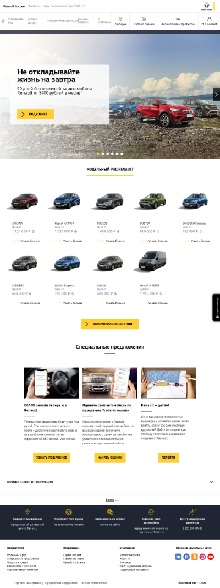

# Описание 

Не забудьте прикрепить изображения.

# Отчёт
## Студент
Кравцов Тимофей Викторович
### Плохой дизайн
*Мультимедийная  система в автомобилях от АвтоВаза ( в Ладах)
*На главном экране всё интуитвно понятно всего четыре    простых и    крупных иконки. 
*Но в окне аудиоплеера слишком много кнопок, при чём назначение  некоторых совершенно не понятно
*Так же непонятны назначения некоторых кнопок в окне звонков
*В машине мультимедийная система должна облегчать  работу водителя во время движения, должно быть всё интуитивно понятно и достаточно крупно, чтобы водитель не отвлекаясь от вождения мог быстро задавть команды системе

 
### Хороший дизайн
*Сайт Renault
*Сразу видны наименования разделов сайта, ориентированные непосредственно на посетителей сайта (кто с какой целью сюда зашёл: покупатель, владелец или просто присматривающийся)
*Нет мешающего выскакивающего окна с предложением о консультации по телефону, оно плавно сопровождает вас при прокручивании страницы справа 

